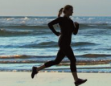

Profile Card UI/UX Design

A simple and attractive Profile Card UI/UX Design created using HTML and CSS. The project displays a developer profile with social media icons, profile information, action buttons, and engagement statistics.

📌 Project Preview

The profile card contains:

- Profile image
- Developer information
- College and course details
- Social media icons
- Subscribe and Message buttons
- Like, comment, and share statistics
- Responsive viewport setup
- Modern card-style UI with rounded corners and shadows

🛠️ Technologies Used

- HTML5
- CSS3
- Font Awesome 7.3.1

📂 Project Structure

Profile-Card/
│
├── index.html
├── Capture.PNG
└── README.md

✨ Features

Profile Section

Displays the user's profile image along with:

- Website Developer
- Dezyne Ecole College
- BCA 1st Year

Social Media Icons

The design includes icons for:

- Facebook
- Instagram
- LinkedIn
- GitHub
- Behance

Action Buttons

Two interactive-looking buttons are included:

- Subscribe
- Message

Engagement Statistics

The card displays:

- ❤️ 60.4k Likes
- 💬 20k Comments
- ↗️ 12.6k Shares

🎨 Design

The design uses:

- Navy blue as the primary color
- Rounded corners
- Box shadow
- Flexbox for layout
- Circular profile image
- Font Awesome icons
- A clean two-column profile-card layout

🚀 How to Run

1. Download or clone the project.

2. Make sure "index.html" and "Capture.PNG" are in the same folder.

3. Open "index.html" in any modern web browser.

For example:

Double-click → index.html

Or open it using VS Code Live Server.

🌐 Font Awesome

This project uses Font Awesome through the following CDN:

<link rel="stylesheet" href="https://cdnjs.cloudflare.com/ajax/libs/font-awesome/7.3.1/css/all.min.css">

An internet connection is required for the Font Awesome icons to load when using the CDN.

📸 Profile Image

The HTML expects the profile image to be named:

Capture.PNG

and placed in the same directory as "index.html".

You can replace "Capture.PNG" with your own image by changing:

to:

📱 Responsive Design

The project includes the following viewport configuration:

<meta name="viewport" content="width=device-width, initial-scale=1.0">

However, the current CSS uses several fixed dimensions and absolute positioning, so additional CSS media queries would be recommended for better mobile responsiveness.

🔮 Future Improvements

Some possible improvements include:

- Add responsive media queries
- Make the Subscribe and Message buttons functional
- Add actual social media links
- Improve accessibility with meaningful "alt" text
- Add hover animations
- Make the profile information dynamic
- Improve mobile and tablet layouts
- Replace fixed positioning with responsive CSS

👨‍💻 Author

BCA 1st Year Student
Dezyne Ecole College

📄 License

This project is created for learning and educational purposes. You are free to modify and improve the design for your own projects.# Profile_card
